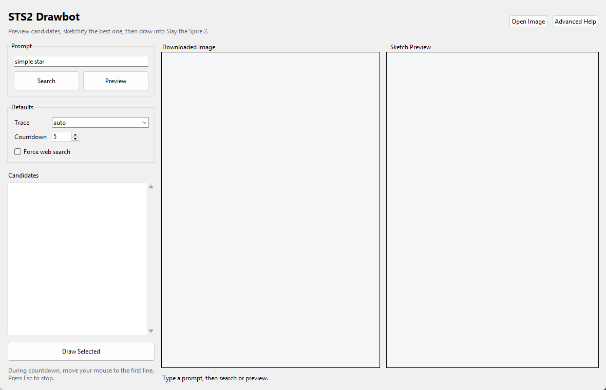
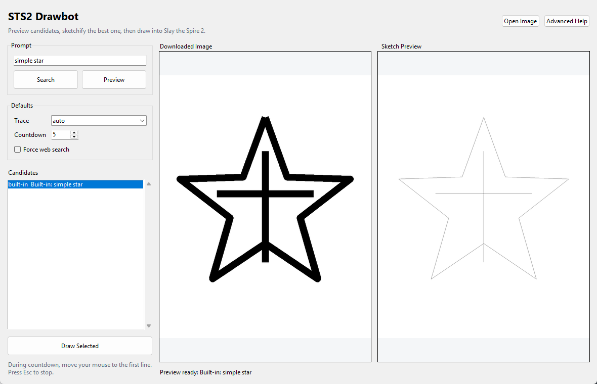

# STS2 Drawbot

STS2 Drawbot turns a text prompt or image into right-click drawing strokes for the Slay the Spire 2 map drawing surface.

It is built for quick in-game doodles: preview first, then draw only when you add `--draw`.

## Features

- Simple prompt interface: `--prompt "simple star" --draw`
- Built-in vector doodles for common shapes: star, heart, circle, triangle, square, arrow, smiley, poop
- Image search through Openverse, DuckDuckGo Images, optional Google Custom Search, and Wikimedia Commons
- Sketch-style extraction for shaded drawings and grayscale illustrations
- Longer intentional strokes for cleaner in-game output
- Mouse-anchor placement: the drawing starts where your cursor is after the countdown
- Safe scaling/clamping to keep drawings inside the Slay the Spire 2 map-paper area
- Emergency stop with `Esc` or the PyAutoGUI top-left mouse failsafe

## Requirements

- Python 3.11 or newer
- Tkinter support in your Python install
- A visible desktop session for mouse automation

The CLI search, preview, and drawing workflow is cross-platform. Windows can auto-target the Slay the Spire 2 window; macOS/Linux draw through PyAutoGUI and use either a safe screen canvas or a manually calibrated `--area`.

The GUI search and preview workflow is cross-platform. The GUI Draw button is currently Windows-only.

## Install

Windows:

```powershell
cd E:\projects\sts2-drawbot
.\install.ps1
```

macOS/Linux:

```sh
cd sts2-drawbot
./install.sh
```

## Preview

```powershell
.\run.ps1 --prompt "simple poop emoji"
```

This writes a preview image to `previews\` and does not move the mouse.

## GUI

For candidate browsing and easier previewing, launch the desktop UI:

Windows:

```powershell
.\run-gui.ps1
```

macOS/Linux:

```sh
./run-gui.sh
```

The GUI lets you:

- search from a prompt
- inspect downloaded candidates
- compare the source image and sketch preview side by side
- open a local image
- choose trace mode
- draw the selected preview into Slay the Spire 2

On non-Windows systems, the Draw button is disabled and the GUI acts as a candidate/preview workbench.

### Screenshots

Initial GUI:



Candidate selected with sketch preview:



## Draw

Open the Slay the Spire 2 map drawing UI first, then run:

Windows:

```powershell
.\run.ps1 --prompt "simple poop emoji" --draw
```

macOS/Linux:

```sh
./run.sh --prompt "simple poop emoji" --draw
```

On macOS/Linux, keep Slay the Spire 2 visible and move your mouse to the first line during the countdown. For best results, calibrate the map-paper area with `--mouse-pos`, then pass `--area X,Y,W,H`.

When the countdown starts, move your mouse to where the first line should begin. The tool scales the full drawing into the safe map-paper area; if the mouse anchor would push part of the drawing off the paper, it clamps the drawing back inside the safe area.

Press `Esc` to stop while drawing on Windows. On any platform, moving the mouse to the top-left corner of the screen aborts; Ctrl+C also stops from the terminal.

## Examples

```powershell
.\run.ps1 --prompt "simple star" --draw
.\run.ps1 --prompt "anime sailor moon line art" --draw
.\run.ps1 --prompt "sketch portrait of a wizard" --draw
```

Force web image search instead of built-in prompt handling:

```powershell
.\run.ps1 --prompt "anime sailor moon line art" --draw --no-builtins
```

Use a local image and force the sketch extractor:

```powershell
.\run.ps1 --image "C:\path\to\drawing.png" --mode sketch --draw
```

## Advanced Options

Most tuning is hidden from normal help because the defaults are tuned for Slay the Spire 2:

```powershell
.\run.ps1 --advanced-help
```

Useful advanced options:

- `--area X,Y,W,H`: manually set the safe drawing rectangle
- `--fit-padding N`: keep more or less space from the safe-area edges
- `--abort-key f9`: change the stop hotkey
- `--input-backend pyautogui`: force the cross-platform mouse backend
- `--center-in-window`: center the drawing in the target canvas instead of starting at the mouse
- `--mode sketch`: force sketch extraction for shaded drawings
- `--scale N` and `--max-strokes N`: tune detail and runtime

## Search Providers

The default prompt flow uses public image sources that can be queried without setup. Google Images is supported through the official Custom Search API if these environment variables are set:

```powershell
$env:GOOGLE_API_KEY = "..."
$env:GOOGLE_CSE_ID = "..."
```

Without those keys, Openverse, DuckDuckGo Images, and Wikimedia Commons are still used.

## Releases

Releases are generated automatically from version tags, matching the workflow style used by `RejectKid/copy-pasta`:

```powershell
git tag 0.4.0
git push origin 0.4.0
```

The release workflow builds ZIP packages for:

- Windows x64
- Linux x64
- macOS universal

GitHub generates the release notes automatically from merged changes.

## Notes

This is mouse automation for a game UI. Keep the game focused while drawing, and keep your hand near `Esc` until you trust the selected preview. Very dense source images may still need a simpler prompt, a cleaner line-art source, or lower `--max-strokes`.
